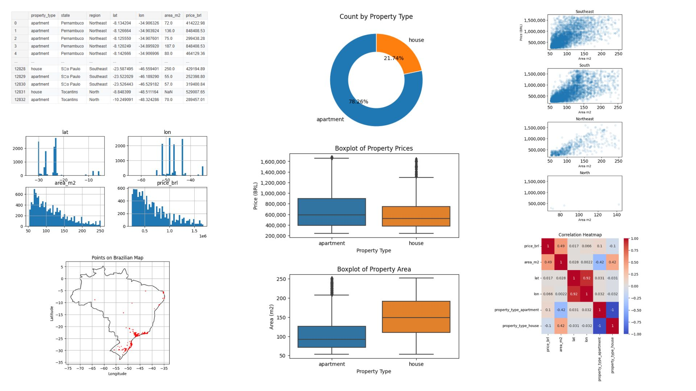

# Brazil Real Estate Price Prediction

This project uses the Brazil Real Estate dataset to build machine learning models that predict property prices (`price_brl`) based on various features such as property type, location, and area. The goal is to provide insights into the factors influencing real estate prices in Brazil and to develop predictive models for pricing.

## Dataset

The dataset is sourced from [Kaggle - Brazil Real Estate](https://www.kaggle.com/datasets/ashishkumarjayswal/brasil-real-estate) and includes the following key features:
- **Property Type**: e.g., apartment, house.
- **Location**: Includes state, region, latitude, and longitude.
- **Area**: Size of the property in square meters (`area_m2`).
- **Price (BRL)**: Target variable representing the property price in Brazilian Reais.



## Project Structure

- **Data Preprocessing**: Handling missing values, encoding categorical variables, and feature scaling.
- **Exploratory Data Analysis**: Visualizations to understand data distribution and relationships between features.
- **Modeling**: Implementing Linear Regression and Random Forest models to predict property prices.
- **Evaluation**: Comparing model performances using metrics like Mean Squared Error (MSE) and R² score.

## Results

- **Linear Regression**: Basic model with limited predictive power (low R² score).
  - **Training Set**:
    - **MSE**: 72,896,765,964.67
    - **R²**: 0.3932
  - **Test Set**:
    - **MSE**: 77,714,551,679.86
    - **R²**: 0.3557
- **Random Forest**: Improved performance with a higher R² score, indicating better handling of complex relationships.
  - **Training Set**:
    - **MSE**: 18,110,755,754.76
    - **R²**: 0.8492
  - **Test Set**:
    - **MSE**: 40,181,566,616.65
    - **R²**: 0.6669

## Conclusion

- **Random Forest** outperformed **Linear Regression** for predicting property prices, with an R² of **0.6669** on the test set.
- The features **Area_m2** and **Property_type** were strong predictors, while geographical coordinates (Lat and Lon) added further explanatory power.
- Further refinement and tuning of the models, along with the addition of more features, could improve the predictive performance. However, the **Random Forest** model currently stands as the best-performing option.


## How to Run

1. Clone the repository:
   ```bash
   git clone https://github.com/matthewz5/Kaggle-Brasil-real-estate-Data.git
   ```
2. Install dependencies:
   ```bash
   pip install -r requirements.txt
   ```
3. Run the Jupyter notebook or Python scripts to explore data and train models.

## Contributing

Feel free to open issues or submit pull requests to enhance the project!

## License

This project is licensed under the MIT License.
